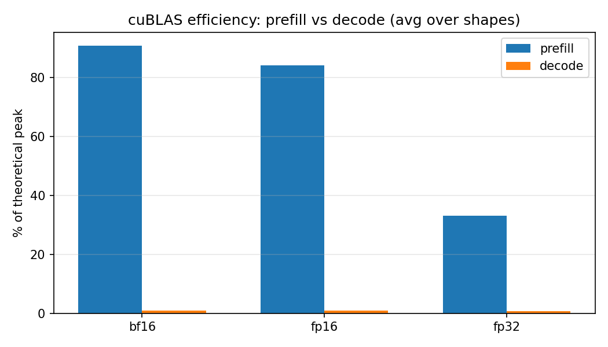
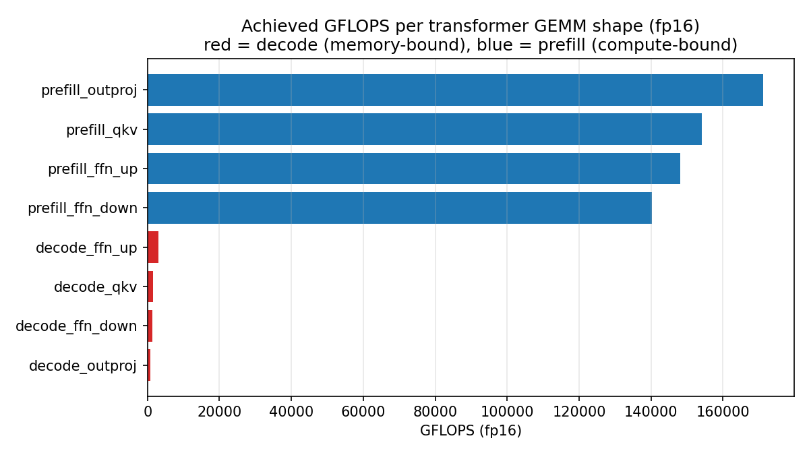

# LLM GEMM Atlas

LLM GEMM Atlas connects kernel-level GEMM efficiency with end-to-end LLM
inference traces. The question is simple:

> How much of inference time lands in GEMM, and how much of that GEMM work is
> wasted on memory-bound decode shapes?

## TL;DR

On an NVIDIA RTX 6000 Ada Generation GPU, transformer-shaped fp16 cuBLAS GEMMs
show a sharp prefill/decode split:

- Prefill GEMMs average **84.3% of theoretical fp16 peak**.
- Decode GEMMs average **0.9% of theoretical fp16 peak**.
- The prefill/decode efficiency gap is **89.9x**.
- In a 128-token `Qwen/Qwen2.5-1.5B` greedy decode run, the top GEMM kernels
  account for **501.9 ms** of GPU kernel time, or about **70.2%** of total GPU
  kernel time reported by Nsight Systems.

That is the skinny-GEMM penalty in one line: decode repeatedly launches
`M=1` GEMV/GEMM work that is bandwidth/launch-limited, while prefill exposes
large dense matrices that keep Tensor Cores busy.

## Setup

Environment used for the committed results:

| Item | Value |
| --- | --- |
| Host | `c2smarter-MS-7D69` |
| GPU | NVIDIA RTX 6000 Ada Generation |
| Driver | 580.126.09 |
| System CUDA | 13.0 |
| Profiling tool | Nsight Systems 2023.1.2 via `/usr/local/cuda-12.1/bin/nsys` |
| Python env | conda `kernellab-atlas-cu121` |
| PyTorch | `2.5.1+cu121` |
| PyTorch CUDA runtime | 12.1 |
| Transformers | 4.46.3 |
| Model | `Qwen/Qwen2.5-1.5B` |
| Inference mode | fp16, greedy decode, `use_cache=True`, 128 generated tokens |

The inference sanity run generated 128 tokens in **1161.8 ms** (**110.2 tok/s**)
with **3.11 GB** peak GPU memory.

## Methodology

### Microbench

`atlas/bench_transformer_gemm.py` builds transformer-shaped GEMMs and times
`torch.matmul`, which dispatches to cuBLAS. Timing uses CUDA events around the
timed loop, after 20 warmup iterations and over 100 measured iterations.

The FLOP model is:

```text
flops = 2 * M * N * K
gflops = flops / seconds / 1e9
pct_peak = gflops / theoretical_peak_gflops * 100
```

Strict fp32 is the default: TF32 was disabled for this run.

### End-to-End Profile

`atlas/infer_with_profile.py` uses an explicit prefill forward pass followed by
a token-by-token decode loop. NVTX ranges label `prefill`, `decode_loop`, and
`decode_token`, and Nsight captures only the `cudaProfilerStart` /
`cudaProfilerStop` region.

The profile command was:

```bash
CUDA_VISIBLE_DEVICES=0 /usr/local/cuda-12.1/bin/nsys profile \
  -o traces/trace_qwen \
  --force-overwrite=true \
  --capture-range=cudaProfilerApi \
  --cuda-memory-usage=true \
  /home/c2smarter/anaconda3/bin/conda run -n kernellab-atlas-cu121 \
    python atlas/infer_with_profile.py \
      --model Qwen/Qwen2.5-1.5B \
      --max-new-tokens 128
```

The committed `traces/trace_qwen.nsys-rep` is 18 MB, below the 50 MB commit
threshold. Open it with Nsight Systems GUI for the timeline view. The headless
workspace did not have `nsys-ui` screenshot export available, so the repo
commits the report and exported stats rather than GUI screenshots.

## Microbench Results

Output artifact:

- [`results/transformer_gemm_atlas.csv`](../results/transformer_gemm_atlas.csv)

Plots:





### fp16 Efficiency

| Shape | Phase | M | N | K | ms | GFLOPS | % peak |
| --- | --- | ---: | ---: | ---: | ---: | ---: | ---: |
| `prefill_qkv` | prefill | 2048 | 12288 | 4096 | 1.3383 | 154,047.9 | 84.64 |
| `prefill_outproj` | prefill | 2048 | 4096 | 4096 | 0.4015 | 171,148.0 | 94.04 |
| `prefill_ffn_up` | prefill | 2048 | 11008 | 4096 | 1.2465 | 148,166.3 | 81.41 |
| `prefill_ffn_down` | prefill | 2048 | 4096 | 11008 | 1.3173 | 140,201.7 | 77.03 |
| `decode_qkv` | decode | 1 | 12288 | 4096 | 0.0623 | 1,616.8 | 0.89 |
| `decode_outproj` | decode | 1 | 4096 | 4096 | 0.0388 | 864.1 | 0.47 |
| `decode_ffn_up` | decode | 1 | 11008 | 4096 | 0.0302 | 2,986.9 | 1.64 |
| `decode_ffn_down` | decode | 1 | 4096 | 11008 | 0.0665 | 1,356.1 | 0.75 |

Headline:

```text
HEADLINE (fp16): prefill avg 84.3% peak vs decode avg 0.9% peak (89.9x gap)
```

## End-to-End Kernel Breakdown

Output artifacts:

- [`results/kernel_breakdown.csv`](../results/kernel_breakdown.csv)
- [`results/nsys_cuda_gpu_kern_sum_cuda_gpu_kern_sum.csv`](../results/nsys_cuda_gpu_kern_sum_cuda_gpu_kern_sum.csv)
- [`traces/trace_qwen.nsys-rep`](../traces/trace_qwen.nsys-rep)

Top kernels by GPU time:

| Category | Calls | Total ms | % total | Kernel pattern |
| --- | ---: | ---: | ---: | --- |
| GEMM | 14,351 | 353.70 | 49.5 | `cublasGemvParamsEx<__half, __half>` |
| GEMM | 3,556 | 127.59 | 17.8 | `cublasGemvParamsEx<__half, float>` |
| Elementwise | 14,393 | 23.47 | 3.3 | PyTorch elementwise multiply |
| GEMM | 7,112 | 20.61 | 2.9 | `cublasGemvParamsEx<__half, __half>` |
| Attention | 3,360 | 17.87 | 2.5 | `pytorch_flash::flash_fwd_kernel` |

The top 15 rows in `kernel_breakdown.csv` account for the visible hot path.
The three largest GEMM rows alone account for **501.9 ms** and **70.2%** of
reported GPU kernel time. Attention is present, but the dominant repeated work
in this greedy decode trace is GEMV/GEMM.

## Microbench to E2E Mapping

| E2E kernel pattern | Matched atlas category | Atlas fp16 % peak | E2E total ms | Interpretation |
| --- | --- | ---: | ---: | --- |
| `cublasGemvParamsEx<__half, __half>` | Decode projections / FFN skinny GEMMs | 0.47-1.64 | 353.70 | Repeated M=1 decode work; dominates GPU kernel time despite low efficiency |
| `cublasGemvParamsEx<__half, float>` | Decode projection variants with fp32 accumulation/output path | 0.47-1.64 | 127.59 | Same skinny-shape regime; likely output/lm-head or projection path |
| `cublasGemvParamsEx<__half, __half>` | Smaller decode GEMV variants | 0.47-1.64 | 20.61 | Additional repeated decode GEMV work |
| `pytorch_flash::flash_fwd_kernel` | Attention | N/A | 17.87 | Attention kernels are visible but much smaller than GEMV/GEMM in this run |

## Findings

1. **Decode is the efficiency cliff.** The same cuBLAS library that reaches
   77-94% of fp16 peak on prefill shapes falls to 0.47-1.64% peak on decode
   shapes where `M=1`.
2. **The E2E trace agrees with the microbench.** Nsight reports GEMV/GEMM
   kernels as the largest decode hot path: the top GEMM rows account for about
   70.2% of total GPU kernel time.
3. **Attention is not the whole story.** FlashAttention appears in the top
   kernels, but only at 17.87 ms / 2.5% in this trace. For short-prompt greedy
   decode, projection and FFN GEMV work dominate.
4. **Batching is the natural serving implication.** Continuous batching raises
   effective `M`, turns repeated skinny GEMVs into fatter GEMMs, and amortizes
   weight reads. This is why serving systems can recover GPU efficiency even
   when single-request decode leaves most FLOPS unused.
5. **The atlas bridges intuition and trace evidence.** The microbench explains
   why decode kernels are inefficient; the Nsight trace shows those kernels
   are not theoretical edge cases but the main E2E hot path for this workload.
